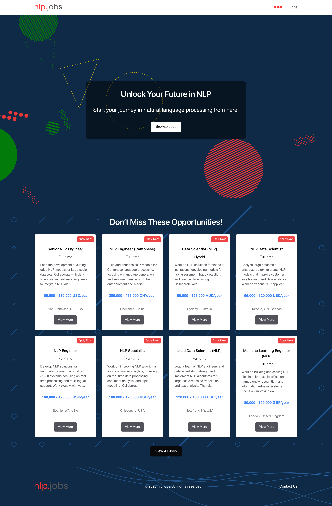
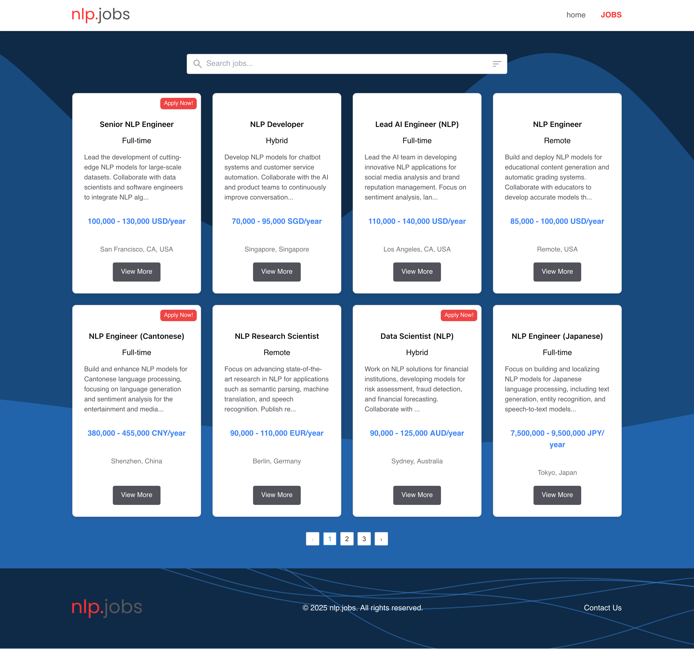
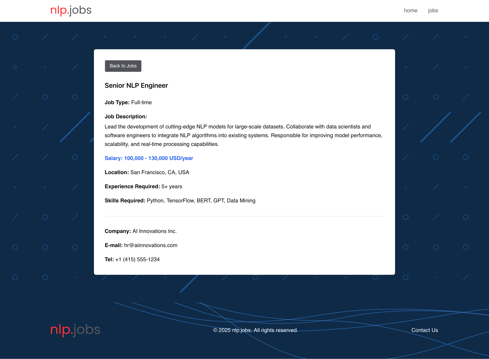
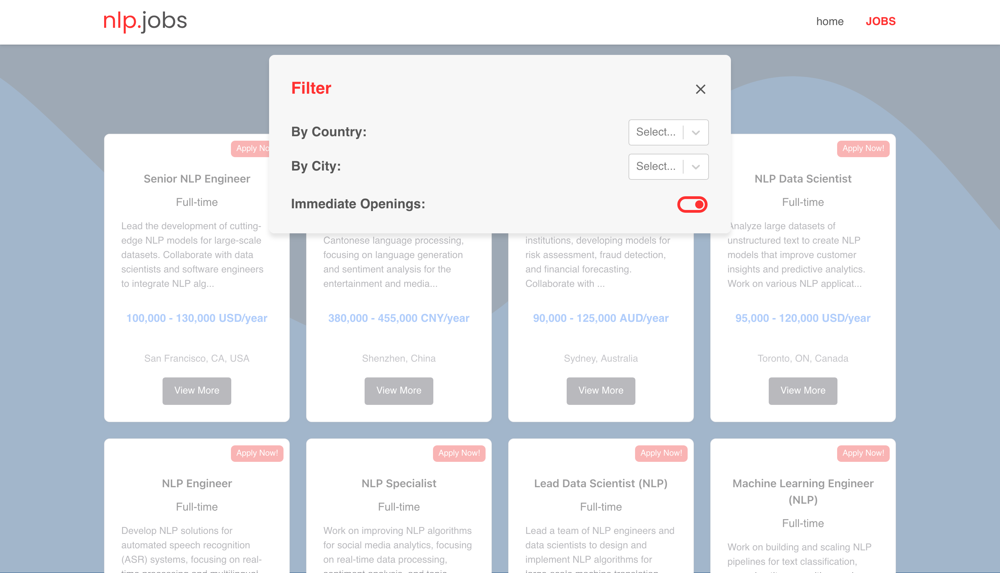

# NLP Jobs

[Live Demo on Netlify](https://nlpjobs.netlify.app)

---

## Project Overview

NLP Jobs is a dedicated job board platform focused on opportunities in the Natural Language Processing (NLP) domain. Users can browse the latest NLP job openings, apply multiple filters and search keywords, and view detailed job descriptions.

This project uses a modern technology stack with a **React** frontend built with **Tailwind CSS** and **Chakra UI**, an **Express.js** backend, and **MongoDB** for data storage, providing a seamless and responsive user experience.

---

## Technology Stack

- **Frontend:** React, Tailwind CSS, Chakra UI  
- **Backend:** Express.js  
- **Database:** MongoDB  
- **Deployment:** Netlify (frontend) + Netlify Functions (backend APIs)  
- **Others:** React Router, rc-pagination, react-select
- **Background Images:** [BGJar](https://bgjar.com/) 

---

## Project Structure

```
/src
  /assets           // Static assets like images, SVGs
  /components       // Reusable React components
  /pages            // Page-level components
  /types            // TypeScript type definitions
  /utils            // Utility functions
  App.tsx           // Root component
  main.tsx          // Entry point for the app
```

---

## Features

- Paginated job listings  
- Multi-criteria job filtering (country, city, keyword, urgent jobs)  
- Detailed job description page  
- Search bar and filter panel  
- Responsive design supporting mobile devices  
- Clean and modern UI combining Tailwind and Chakra UI

---

## Quick Start

### 1. Clone the repository

```bash
git clone https://github.com/DJOMIDO/nlpjobs.git
cd nlpjobs
```

### 2. Install dependencies

```bash
npm install
```

### 3. Configure environment variables

Create a `.env` file in the root directory and add your MongoDB connection string:

```env
VITE_MONGODB_URI=your-mongodb-connection-string
```

### 4. Run the development server

You can start the local development server with:

```bash
npm run dev
```

or, if you use Netlify CLI, run:

```bash
netlify dev
```

### 5. Backend simulation

The backend API is implemented using Netlify Functions, with data stored in MongoDB Atlas. For local development, you may use tools like json-server to mock the API.

---

## Deployment

- Frontend deployed on [Netlify](https://www.netlify.com/)  
- Backend API hosted with Netlify Functions; no separate server required

---

## Screenshots

  
  
  


---

## Contribution

Contributions via issues and pull requests are welcome to improve features or fix bugs.

---

## License

MIT License
