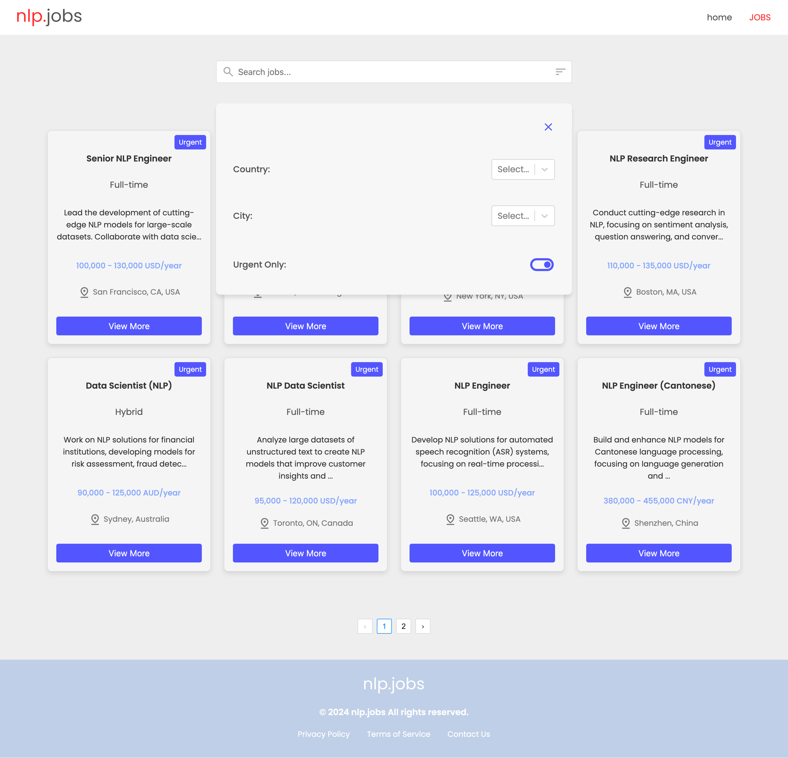

# 🧠 NLP Jobs

A modern web application for browsing and managing NLP-related job listings.  
Built with **React + TypeScript + Vite**, and powered by **json-server** for mock backend support.

---

## 🚀 Features

- 🔎 Search NLP job opportunities by keyword
- 🎯 Filter jobs by country, city, salary, and job type
- 📄 View full job details in a separate page
- 📦 Powered by `json-server` as a mock REST API
- ⚡ Fast and modular frontend using React + TypeScript
- 💅 Clean and responsive UI

---

## 🖼️ Screenshots

### 🏠 Home Page
Showcases a hero banner and the most urgent job listings.


---

### 💼 Jobs Page
Paginated view of all available NLP jobs with integrated search and filter components.


---

### 🔍 Search Functionality
Real-time job search by typing keywords related to title, job description, location, or filtering results based on urgency.



---

### 📄 Job Details
Dedicated page to display full job information including skills required, salary, location, and company contact.


---

## ⚙️ Tech Stack

- **Frontend**: React 18, TypeScript, React Router, Vite
- **Mock API**: [json-server](https://github.com/typicode/json-server)
- **UI**: Custom CSS + utility-first design
- **Pagination**: `rc-pagination`
- **Select Filter**: `react-select`

---

## 📦 Setup Instructions

1. **Clone the repository**

```bash
git clone https://github.com/DJOMIDO/nlpjobs.git
cd nlpjobs
```

2. **Install dependencies**

```bash
npm install
```

3. **Start the frontend**

```bash
npm run dev
```

4. **Start the mock backend (`json-server`)**

> The job data is located in `data/jobs.json`.

```bash
npx json-server --watch data/jobs.json --port 3001
```

This will launch a REST API at `http://localhost:3001/jobs`.

---

## 📁 Project Structure

```
src/
├── components/     # Reusable UI components (cards, nav, footer, etc.)
├── pages/          # Page-level components (Home, Jobs, NotFound, etc.)
├── data/           # Local JSON job data
├── types/          # TypeScript type definitions
├── App.tsx         # App routing
└── main.tsx        # App entry point
```

---

## 📄 License

This project is licensed under the MIT License.

---
