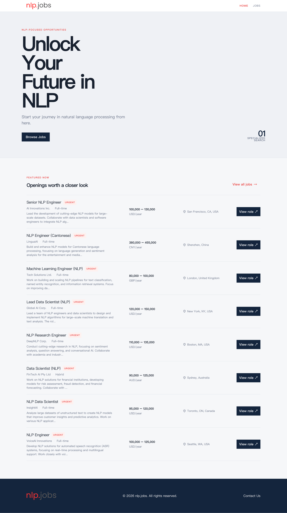
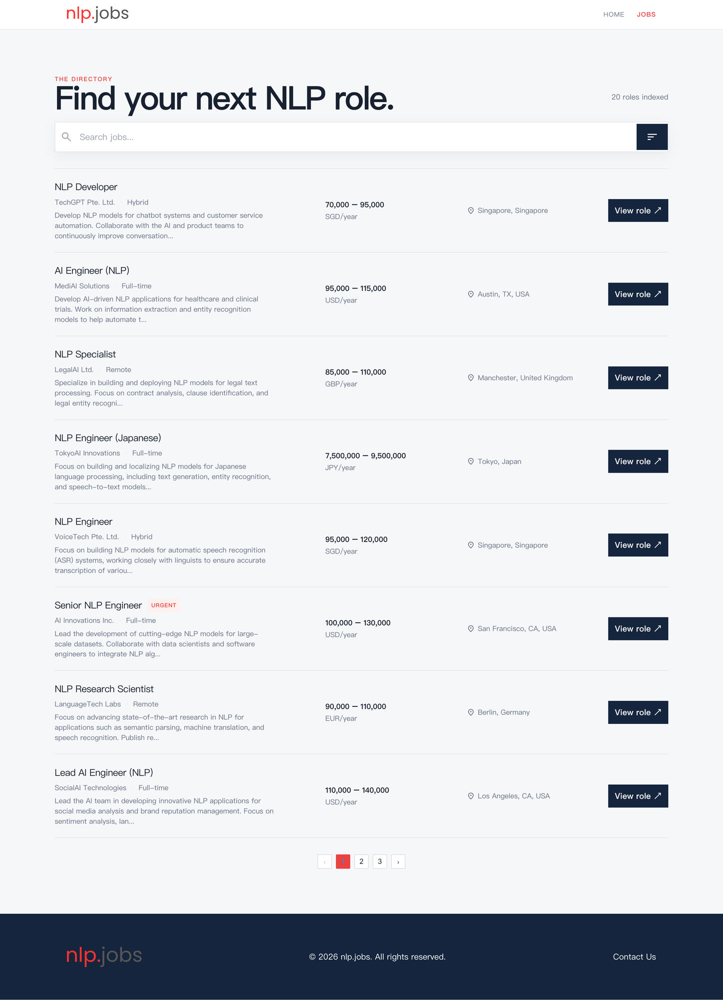
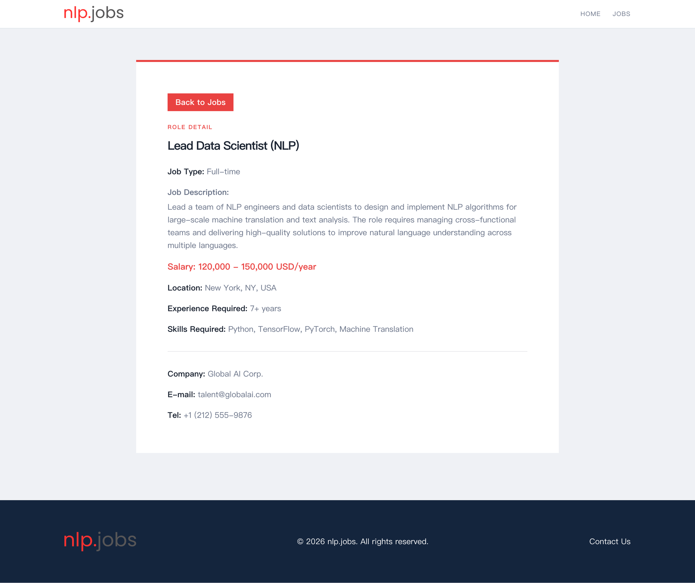
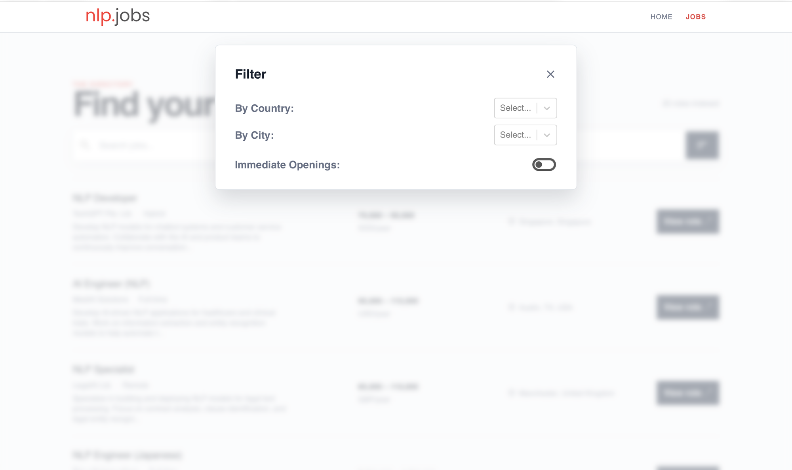

# NLP Jobs

[Live Demo on Netlify](https://nlpjobs.netlify.app)

---

## Project Overview

NLP Jobs is a dedicated job board platform focused on opportunities in the Natural Language Processing (NLP) domain. Users can browse the latest NLP job openings, apply multiple filters and search keywords, and view detailed job descriptions.

This project uses a modern technology stack with a **React** frontend built with **Tailwind CSS** and **Chakra UI**, plus a small **Netlify Function** API. The API serves committed demo data by default, with optional MongoDB support when a connection string is configured.

---

## Technology Stack

- **Frontend:** React, Tailwind CSS, Chakra UI  
- **Backend:** Netlify Functions (Express-compatible handler)
- **Database:** Committed demo dataset by default; optional MongoDB Atlas
- **Deployment:** Netlify (frontend) + Netlify Functions (backend APIs)  
- **Others:** React Router, rc-pagination, react-select
- **Background Images:** [BGJar](https://bgjar.com/) 

---

## Project Structure

```
/src
  /assets           // Static assets like images, SVGs
  /components       // Reusable React components
  /pages            // Page-level components
  /types            // TypeScript type definitions
  /utils            // Utility functions
  App.tsx           // Root component
  main.tsx          // Entry point for the app
```

---

## Features

- Paginated job listings  
- Multi-criteria job filtering (country, city, keyword, urgent jobs)  
- Detailed job description page  
- Search bar and filter panel  
- Responsive design supporting mobile devices  
- Clean and modern UI combining Tailwind and Chakra UI

---

## Quick Start

### 1. Clone the repository

```bash
git clone https://github.com/DJOMIDO/nlpjobs.git
cd nlpjobs
```

### 2. Install dependencies

```bash
npm install
```

### 3. Configure environment variables

Create a `.env` file in the root directory only if you want to test MongoDB-backed data:

```env
MONGODB_URI=your-mongodb-connection-string
```

### 4. Run the local MongoDB-backed development server

After filling in `MONGODB_URI` in `.env`, start Netlify Dev so that the Vite
frontend and the Netlify Function run together:

```bash
npx netlify dev
```

The local site is usually available at `http://localhost:8888`. Test the API
directly at:

```text
http://localhost:8888/.netlify/functions/jobs
```

Do not use only `npm run dev` when testing MongoDB data. Vite serves the
frontend, but it does not execute `netlify/functions/jobs.cjs`.

### 5. Local API development

The backend API is implemented as a Netlify Function at
`/.netlify/functions/jobs`. It always has a small committed dataset available,
so the portfolio works without a database. If `MONGODB_URI` is present, the
function tries MongoDB first and falls back to the demo dataset if the database
is unavailable.

---

## Deployment

- Frontend deployed on [Netlify](https://www.netlify.com/)  
- Backend API hosted with Netlify Functions; no separate server or database is required for the demo

---

## Screenshots

The latest interface is shown below. Older screenshots remain in the
`screenshots/` directory for reference.






---

## Contribution

Contributions via issues and pull requests are welcome to improve features or fix bugs.

---

## License

MIT License
